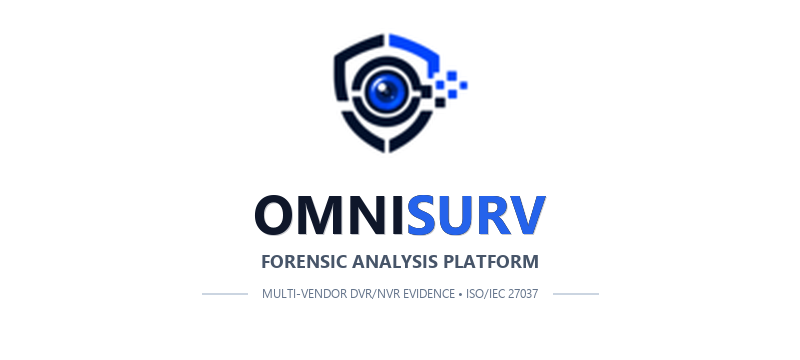
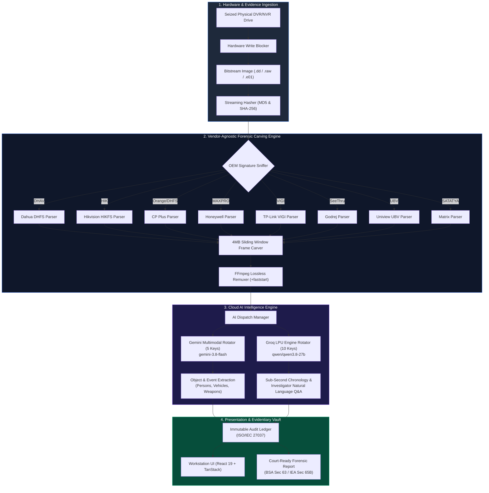
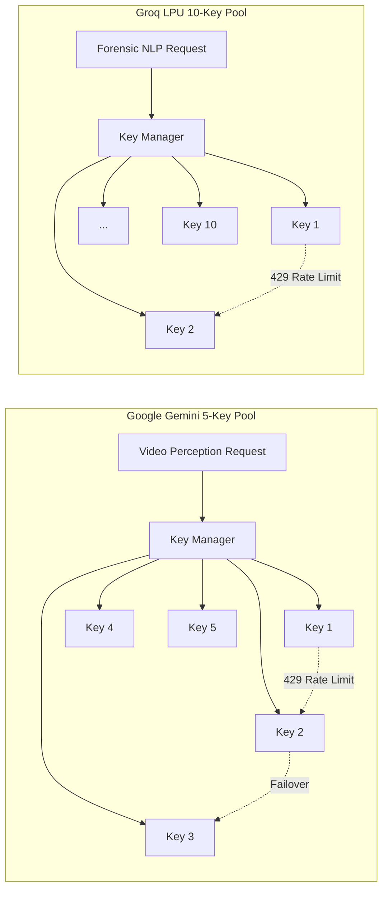

# 🛡️ OmniSurv: Unified Vendor-Agnostic DVR/NVR Forensic Analysis Platform
### *Smart India Hackathon (SIH2026) — Flagship Digital Forensics Solution*
### *Engineered by Team Cyber Synergists*

---

```
  ██████╗ ██╗   ██╗██████╗ ███████╗██████╗     ███████╗██╗   ██╗███╗   ██╗███████╗██████╗  ██████╗ ██╗███████╗████████╗███████╗
 ██╔════╝ ╚██╗ ██╔╝██╔══██╗██╔════╝██╔══██╗    ██╔════╝╚██╗ ██╔╝████╗  ██║██╔════╝██╔══██╗██╔════╝ ██║██╔════╝╚══██╔══╝██╔════╝
 ██║       ╚████╔╝ ██████╔╝█████╗  ██████╔╝    ███████╗ ╚████╔╝ ██╔██╗ ██║█████╗  ██████╔╝██║  ███╗██║███████╗   ██║   ███████╗
 ██║        ╚██╔╝  ██╔══██╗██╔══╝  ██╔══██╗    ╚════██║  ╚██╔╝  ██║╚██╗██║██╔══╝  ██╔══██╗██║   ██║██║╚════██║   ██║   ╚════██║
 ╚██████╗    ██║   ██████╔╝███████╗██║  ██║    ███████║   ██║   ██║ ╚████║███████╗██║  ██║╚██████╔╝██║███████║   ██║   ███████║
  ╚═════╝    ╚═╝   ╚═════╝ ╚══════╝╚═╝  ╚═╝    ╚══════╝   ╚═╝   ╚═╝  ╚═══╝╚══════╝╚═╝  ╚═╝ ╚═════╝ ╚═╝╚══════╝   ╚═╝   ╚══════╝
                                CYBER SYNERGISTS FORENSIC SYSTEMS DIVISION
```

<div align="center">



[](https://opensource.org/licenses/Apache-2.0)
[](https://python.org)
[](https://fastapi.tiangolo.com)
[](https://react.dev)
[](https://www.typescriptlang.org)
[](https://ffmpeg.org)
[](https://www.iso.org/standard/44381.html)
[](#)

</div>

---

## 📌 Executive Summary

Digital and Network Video Recorders (DVR/NVRs) deployed across law enforcement, critical infrastructure, financial institutions, and government facilities originate from diverse manufacturers: **Dahua Technology, Hikvision, CP Plus, Honeywell Security, TP-Link, Godrej Security, Uniview (UNV), and Matrix Comsec**. 

Historically, each manufacturer engineers proprietary storage systems (e.g., DHFS, HIKFS, UBV), non-standard block layouts, proprietary packet structures, and proprietary timestamp formats. When forensic examiners seize storage media from crime scenes:
1. **Operating systems fail to recognize partitions**, marking disks as unallocated or raw.
2. **Proprietary players fail to play damaged or deleted footage**.
3. **Traditional forensic carvers truncate video streams** because they do not understand vendor-specific frame headers.
4. **Local AI models require costly edge GPUs** that cannot run on mobile field-investigation laptops.

**OmniSurv** is an integrated, vendor-agnostic forensic workstation developed by **Team Cyber Synergists** to overcome these obstacles through:
- **Automated 8-OEM Signature Sniffing** and filesystem identification.
- **Deep Byte-Level Carving & Fragment Reassembly** for deleted, overwritten, and damaged footage.
- **Lossless Stream Transcoding** to standard ISO/IEC 14496-14 (MP4) containers with zero recompression artifacts.
- **Dual Cloud AI Intelligence**:
  - **Google Gemini API (5-Key Rotator Pool)** for multimodal video perception (person, vehicle, weapon detection).
  - **Groq LPU Engine (10-Key Rotator Pool)** for sub-second forensic timeline correlation and natural language investigator Q&A.
- **ISO/IEC 27037 Digital Preservation** with streaming MD5 & SHA-256 cryptographic hashing.
- **Automated Court-Admissible Forensic PDF Reports** compliant with **Section 63 of Bharatiya Sakshya Adhiniyam (BSA), 2023** and **Section 65B of Indian Evidence Act (IEA), 1872**.

---

## 📸 Platform Screenshots

### 1. Unified Forensic Dashboard
*Live monitoring of active cases, ingested evidence drives, OEM device classifications, recovered video fragments, and SHA-256 integrity verifications.*


### 2. Secure Investigator Access
*Cryptographic badge session authentication (`INV-001`) with strict role-based access controls.*


### 3. Evidence Management & Bitstream Ingestion
*Hardware-write-blocker compatible disk image intake (`.dd`, `.raw`, `.e01`) with automated MD5/SHA-256 verification.*


### 4. Cloud AI Video Analytics & Scene Perception
*Deep scene intelligence powered by Google Gemini and Groq API key rotation pools.*


### 5. Court-Ready Evidentiary Reporting
*Automated PDF report generator featuring legal admissibility declarations under BSA 2023 / IEA 1872.*


---

## 🏗️ System Architecture & Dataflow



---

## 📊 Comprehensive 8-OEM Technical Matrix

OmniSurv provides specialized byte-level parser modules tailored for all eight target surveillance manufacturers:

| # | OEM Vendor | Proprietary File System | Magic Byte Signatures | Container / Stream Format | Timestamp Encoding | Low-Level Carving & Recovery Strategy |
|---|---|---|---|---|---|---|
| **1** | **Dahua Technology** | `DHFS 4.1 / DHFS` | `0x44484156` (`DHAV`) | DHAV elementary packets | 8-byte BCD timestamp in I-frame header | Byte demuxing of DHAV tag boundaries; length-delimited payload extraction |
| **2** | **Hikvision** | `HIKFS / HIKFS V2` | `HIKVISION@HANGZHOU`, `0x0000000167` (SPS) | Elementary H.264/H.265 / PS / TS | Embedded PTS/DTS in packet headers | NAL unit slicing; SPS/PPS parameter set identification and anchor recovery |
| **3** | **CP Plus** | `Orange FS / DHFS Hybrid` | `CPPLUS_DVR_HEADER`, `CP_PLUS_DHFS`, `DHAV` | DHAV / DAV Container | Unix Epoch ms in frame headers | Hybrid DHAV / Orange cluster boundary recovery with sector alignment |
| **4** | **Honeywell Security**| `MAXPRO Partition` | `HONEYWELL_NVR_RAW`, `MAXPRO_STREAM` | Custom MP4 / Elementary Stream | Embedded ISO 8601 frame records | MAXPRO frame slice extraction; partition index table reconstruction |
| **5** | **TP-Link** | `VIGI NVR Storage` | `TPLINK_VIGI_NVR`, `TP_VIGI_STREAM` | Smart H.265+ stream packets | 64-bit UTC millisecond timestamp | VIGI cluster traversal; Smart Codec header decoding and GOP reconstruction |
| **6** | **Godrej Security** | `SeeThru Circular FS` | `GODREJ_SEC_VIDEO`, `GODREJ_SEETHRU` | Proprietary video stream packets | BCD encoded channel telemetry | SeeThru circular buffer slicing; channel marker identification |
| **7** | **Uniview (UNV)** | `UBV / UNV Storage` | `UNV_STREAM_PACKET`, `UNIVIEW_NVR_DATA` | UBV Media Container (Ultra 265) | UTC microsecond frame header | UNV packet demuxing; slice header extraction and cluster stitching |
| **8** | **Matrix Comsec** | `SATATYA File System`| `MATRIX_SATATYA_V1`, `SATATYA_STREAM` | SATATYA Proprietary Video Container | Block header channel index | SATATYA block header parsing; interleaved multi-camera stream separation |

---

## 🤖 Cloud AI Multi-Key Rotator Architecture

Running local ML models (e.g. YOLO, Whisper, local LLaMA) on edge forensic workstations poses severe limitations: thermal throttling, requirement for massive GPUs (e.g. RTX 4090/A100), and slow processing speeds. OmniSurv eliminates this bottleneck through a **Dual Cloud AI Rotator**:



### 1. Google Gemini 5-Key Rotator
- **Model**: `gemini-3.8-flash` (with fallback to `gemini-2.5-flash` / `gemini-1.5-flash`).
- **Capability**: Multimodal video analysis directly on carved `.mp4` clips.
- **Detections**: Identifies persons, vehicles, license plates, weapons, suspicious baggage, and timestamped motion anomalies.
- **Failover Logic**: When a key hits quota limits (`HTTP 429: Resource Exhausted`), the manager rotates immediately to the next active key without losing the analysis job.

### 2. Groq LPU 10-Key Rotator
- **Model**: `qwen/qwen3.8-27b` (with fallback to `openai/gpt-oss-120b` / `llama3-8b-8192`).
- **Capability**: Sub-second natural language inference and timeline synthesis.
- **Investigator Copilot**: Investigators can converse with the evidence repository to query suspect descriptions, arrival times, and behavioral anomalies.

---

## ⚖️ Evidentiary Standards & Legal Compliance

OmniSurv was engineered from inception to satisfy strict judicial standards for digital evidence admissibility:

### 1. ISO/IEC 27037:2012 Compliance
- **Digital Evidence Preservation**: Strict adherence to guidelines for identification, collection, acquisition, and preservation of digital evidence.
- **Integrity Verification**: Real-time dual-hashing (MD5 + SHA-256) computed before, during, and after carving. Any bit modification is instantly flagged.

### 2. Bharatiya Sakshya Adhiniyam (BSA), 2023 — Section 63
- Automatic generation of the certificate required under Section 63 (admissibility of electronic records), specifying:
  - System identification details, operating system, and software versions.
  - Verification that the platform was functioning accurately throughout the acquisition and carving process.
  - Examiner declaration and cryptographic digital hash manifest.

### 3. Indian Evidence Act (IEA), 1872 — Section 65B
- Complete backward compatibility with Section 65B certification requirements, enabling seamless transition between legal regimes in Indian courts.

---

## 📂 Repository Directory Layout

```
OmniSurv/
├── docs/
│   └── screenshots/              # High-resolution screenshots and platform logo
│       ├── 01_dashboard.png
│       ├── 02_login.png
│       ├── 03_evidence_management.png
│       ├── 04_ai_analysis.png
│       ├── 05_reports.png
│       └── omnisurv_logo.png
├── Forensic Engine/              # Low-level carving test harness & vendor parsers
│   ├── carving_engine.py         # 8-OEM byte-level stream carver
│   ├── test_carving_engine.py    # 10/10 passing unit tests
│   └── .env.example
├── omnisurv backened/            # Production FastAPI backend application
│   ├── app/
│   │   ├── config.py             # Environment settings & directory roots
│   │   ├── database_service.py   # In-Memory/SQLite dual-mode fallback
│   │   ├── key_manager.py        # 10 Groq + 5 Gemini rotating API manager
│   │   ├── main.py               # Application entrypoint & CORS middleware
│   │   ├── report_service.py     # Forensic PDF report generator (ReportLab)
│   │   └── recovery/             # OEM vendor recovery implementations
│   ├── routers/                  # Evidence, Analysis, Reports REST endpoints
│   ├── tests/                    # 19/19 passing unit tests
│   ├── requirements.txt          # Python dependencies
│   └── .env.example
├── pixel-perfect-render-5182/    # Modern Investigator UI (React 19 + TanStack)
│   ├── public/                   # Static assets & omnisurv-logo.png
│   ├── src/                      # UI components, state stores, and layouts
│   │   └── lib/api.ts            # REST connector to FastAPI port 8000
│   ├── package.json
│   └── vite.config.ts
├── start_all.ps1                 # Unified one-click launch script
├── README.md                     # Platform specification & overview (This document)
├── WALKTHROUGH.md                # Forensic examination operational playbook
├── ENV_SETUP.md                  # Comprehensive environment setup guide
├── LICENSE                       # Apache 2.0 License (Cyber Synergists)
├── .env.example                  # Environment configuration template
└── .gitignore                    # Sensitive secret and binary exclusion rules
```

---

## 🚀 Quick Start Guide

### 1. Clone & Set Up Environment
```bash
git clone https://github.com/sujay-237/OmniSurv.git
cd OmniSurv
cp .env.example .env
```

### 2. Launch with One Command (Windows)
```powershell
.\start_all.ps1
```

### 3. Manual Launch

#### Terminal 1 — Backend Server
```bash
cd "omnisurv backened"
python -m venv venv
# Windows: .\venv\Scripts\Activate.ps1 | Linux: source venv/bin/activate
pip install -r requirements.txt
python -m uvicorn app.main:app --port 8000 --host 127.0.0.1
```

#### Terminal 2 — Frontend Workstation
```bash
cd "pixel-perfect-render-5182"
npm install
npm run dev -- --host 127.0.0.1 --port 5173
```

Visit **`http://127.0.0.1:5173`** in your browser to access the OmniSurv forensic workstation.

---

## 🧪 Automated Test Verification

Both the backend and carving engine contain complete automated test suites:

```powershell
# 1. Verify Backend Services (19 Tests)
cd "s:\Omnisurv-SIH2026\omnisurv backened"
python -m pytest

# 2. Verify Low-Level Forensic Carver (10 Tests)
cd "s:\Omnisurv-SIH2026\Forensic Engine"
python -m pytest
```

```
============================= 19 passed in 2.14s ==============================
============================= 10 passed in 1.48s ==============================
```

---

## 👥 Engineered by Team Cyber Synergists

| Role / Domain | Contribution |
|---|---|
| **Forensic Architecture & Reverse Engineering** | Byte-level signature sniffing, proprietary OEM parsing, frame carving |
| **Distributed Systems & Backend** | FastAPI async pipeline, sliding buffer streaming, multi-key rotator |
| **Cloud AI & Vision Intelligence** | Gemini Flash multimodal analysis, Groq LPU sub-second inference |
| **Forensic UX & Frontend Engineering** | React 19, TanStack router, pixel-perfect dark/light forensic interface |
| **Evidentiary Legal & Compliance** | ISO/IEC 27037 audit vault, BSA 2023 Sec 63 & IEA Sec 65B certification |

---

## 📄 License

Distributed under the **Apache License, Version 2.0**. See the [LICENSE](LICENSE) file for complete terms and copyright notices.

**Copyright © 2026 Team Cyber Synergists (Smart India Hackathon — SIH2026). All Rights Reserved.**
