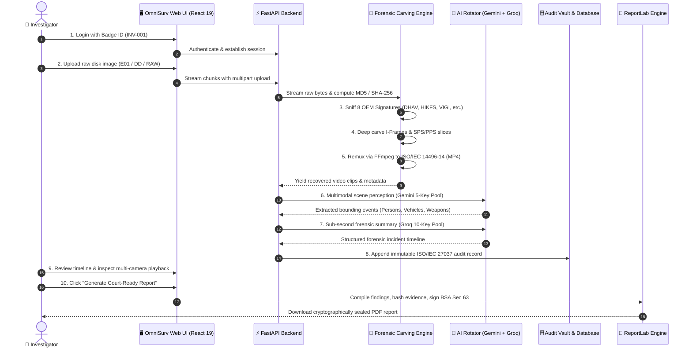
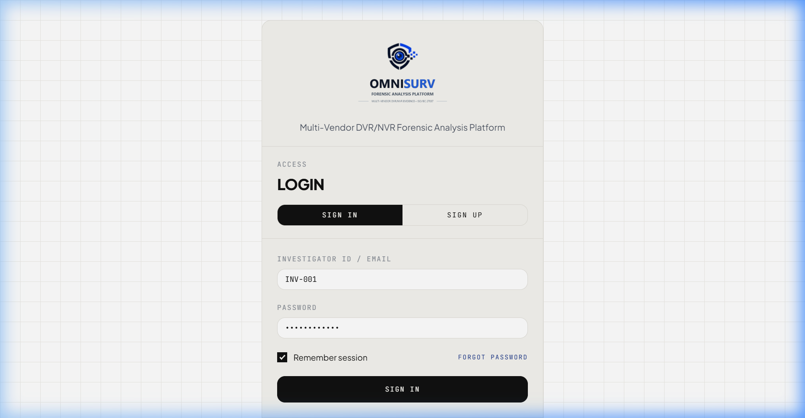
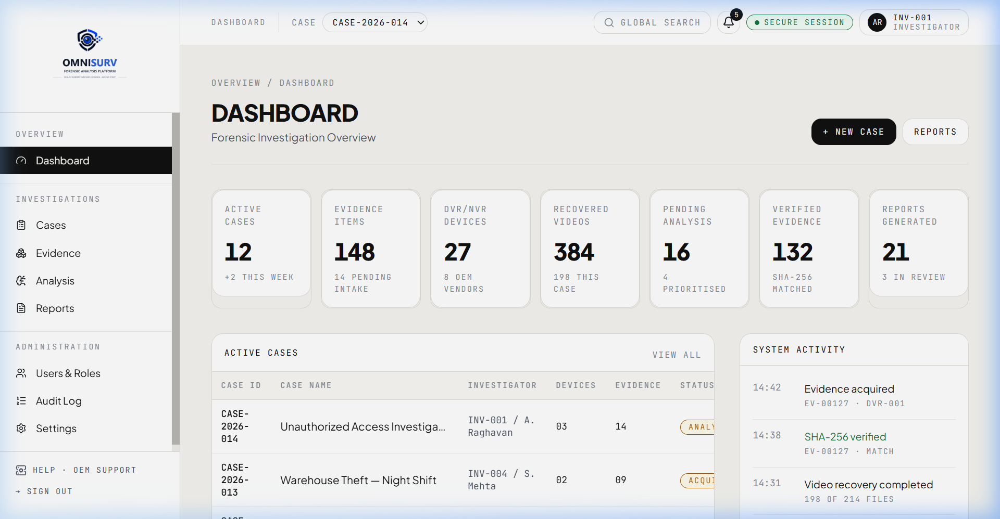
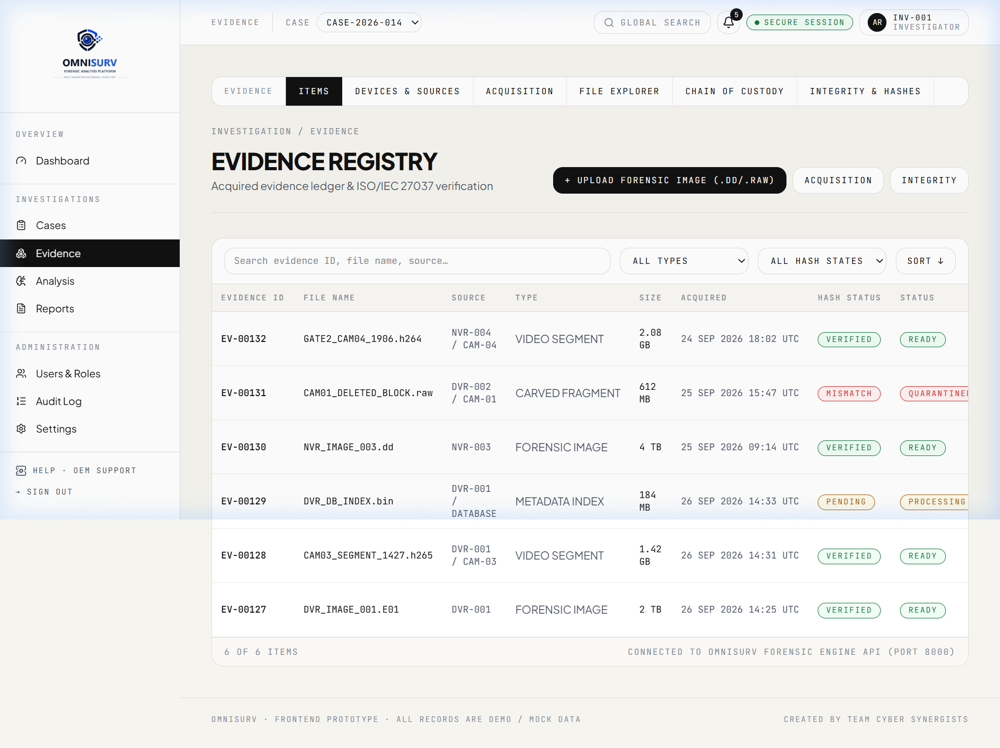
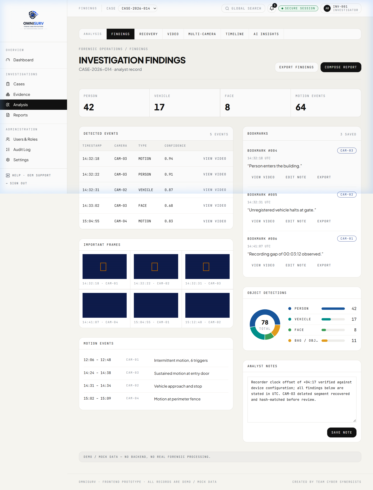
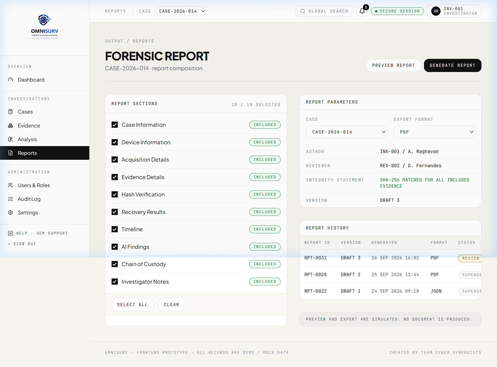

# 🕵️‍♂️ OmniSurv: Forensic Examination & Operational Walkthrough
### *Engineered by Team Cyber Synergists — Smart India Hackathon (SIH2026)*

---

```
  ██████╗ ██╗   ██╗██████╗ ███████╗██████╗     ███████╗██╗   ██╗███╗   ██╗███████╗██████╗  ██████╗ ██╗███████╗████████╗███████╗
 ██╔════╝ ╚██╗ ██╔╝██╔══██╗██╔════╝██╔══██╗    ██╔════╝╚██╗ ██╔╝████╗  ██║██╔════╝██╔══██╗██╔════╝ ██║██╔════╝╚══██╔══╝██╔════╝
 ██║       ╚████╔╝ ██████╔╝█████╗  ██████╔╝    ███████╗ ╚████╔╝ ██╔██╗ ██║█████╗  ██████╔╝██║  ███╗██║███████╗   ██║   ███████╗
 ██║        ╚██╔╝  ██╔══██╗██╔══╝  ██╔══██╗    ╚════██║  ╚██╔╝  ██║╚██╗██║██╔══╝  ██╔══██╗██║   ██║██║╚════██║   ██║   ╚════██║
 ╚██████╗    ██║   ██████╔╝███████╗██║  ██║    ███████║   ██║   ██║ ╚████║███████╗██║  ██║╚██████╔╝██║███████║   ██║   ███████║
  ╚═════╝    ╚═╝   ╚═════╝ ╚══════╝╚═╝  ╚═╝    ╚══════╝   ╚═╝   ╚═╝  ╚═══╝╚══════╝╚═╝  ╚═╝ ╚═════╝ ╚═╝╚══════╝   ╚═╝   ╚══════╝
                          OPERATIONAL FORENSIC INVESTIGATOR PLAYBOOK
```

---

## 📑 Table of Contents
1. [Overview & Investigation Lifecycle](#1-overview--investigation-lifecycle)
2. [End-to-End Forensic Pipeline Flowchart](#2-end-to-end-forensic-pipeline-flowchart)
3. [Phase 1: Investigator Authentication & Case Creation](#phase-1-investigator-authentication--case-creation)
4. [Phase 2: Forensic Bitstream Ingestion & Cryptographic Hashing](#phase-2-forensic-bitstream-ingestion--cryptographic-hashing)
5. [Phase 3: Automated OEM Signature Sniffing](#phase-3-automated-oem-signature-sniffing)
6. [Phase 4: Low-Level Carving & Fragment Reassembly](#phase-4-low-level-carving--fragment-reassembly)
7. [Phase 5: Lossless Codec Transcoding & Web Stream Packaging](#phase-5-lossless-codec-transcoding--web-stream-packaging)
8. [Phase 6: Multi-Camera Timeline Synchronization](#phase-6-multi-camera-timeline-synchronization)
9. [Phase 7: Cloud AI Video Analytics (Gemini & Groq Key Rotation)](#phase-7-cloud-ai-video-analytics-gemini--groq-key-rotation)
10. [Phase 8: Chain of Custody & Tamper-Evident Audit Logging](#phase-8-chain-of-custody--tamper-evident-audit-logging)
11. [Phase 9: Court-Admissible Forensic PDF Export (BSA Sec 63 / IEA Sec 65B)](#phase-9-court-admissible-forensic-pdf-export-bsa-sec-63--iea-sec-65b)

---

## 1. Overview & Investigation Lifecycle

When law enforcement or forensic investigators seize physical DVR/NVR hard drives from a crime scene, standard operating systems (Windows NTFS, Linux EXT4, macOS APFS) fail to mount the storage partitions. DVR manufacturers purposely use unformatted or proprietary storage schemes to prevent consumer tampering.

**OmniSurv**, developed by **Team Cyber Synergists**, provides a single unified workflow that takes raw physical drives or forensic bitstream images (`.dd`, `.raw`, `.img`, `.e01`), automatically identifies the OEM filesystem, carves intact and deleted video frames, transcodes them into standard H.264/MP4, performs AI-driven scene analysis, and outputs legally admissible forensic reports.

---

## 2. End-to-End Forensic Pipeline Flowchart



---

## Phase 1: Investigator Authentication & Case Creation

### Visual Walkthrough


1. Navigate to `http://127.0.0.1:5173/login`.
2. Enter your authorized Investigator ID (e.g., `INV-001`) and session credentials.
3. Upon authorization, the workstation routes to the main command center.



4. The **Overview Dashboard** provides an executive summary:
   - **Active Cases** under investigation.
   - **Total Evidence Items** ingested.
   - **DVR/NVR Devices** detected across the 8 OEM families.
   - **Recovered Video Clips** (including carved deleted fragments).
   - **Cryptographic Hash Verification Rate** (100% SHA-256 integrity).

---

## Phase 2: Forensic Bitstream Ingestion & Cryptographic Hashing

### Operational Procedure


1. Connect the seized DVR hard drive using a hardware write blocker (e.g., Tableau, CRU WiebeTech) to ensure bit-level physical write inhibition.
2. In the **Evidence Management** tab (`/evidence`), select **"Acquire / Upload Evidence Image"**.
3. Select any raw image format:
   - Raw Bitstream: `.dd`, `.raw`, `.img`, `.bin`
   - Expert Witness Format: `.e01`
4. The OmniSurv ingestion pipeline calculates real-time cryptographic hashes in 4MB streaming chunks:
   - **MD5**: High-speed secondary verification.
   - **SHA-256**: Primary court-admissible cryptographic identifier.
5. The computed hash is permanently bound to the evidence profile in the audit vault, fulfilling **ISO/IEC 27037** requirements for digital evidence preservation.

---

## Phase 3: Automated OEM Signature Sniffing

OmniSurv scans the initial partition blocks and headers to classify the target storage system against 8 leading surveillance manufacturers:

| Vendor | Header Signature Pattern | Identified Storage Architecture |
|---|---|---|
| **Dahua Technology** | `0x44 0x48 0x41 0x56` (`DHAV`) | DHFS / DHFS4.1 File System |
| **Hikvision** | `HIKVISION@HANGZHOU`, `0x00 0x00 0x00 0x01 0x67` | HIKFS / HIKFS V2 Structured Blocks |
| **CP Plus** | `CPPLUS_DVR_HEADER`, `CP_PLUS_DHFS`, `DHAV` | Orange FS / DHFS Hybrid |
| **Honeywell Security**| `HONEYWELL_NVR_RAW`, `MAXPRO_STREAM` | Honeywell MAXPRO Stream Partition |
| **TP-Link** | `TPLINK_VIGI_NVR`, `TP_VIGI_STREAM` | VIGI Intelligent Cluster Storage |
| **Godrej Security** | `GODREJ_SEC_VIDEO`, `GODREJ_SEETHRU` | SeeThru Circular Recording Buffer |
| **Uniview (UNV)** | `UNV_STREAM_PACKET`, `UNIVIEW_NVR_DATA` | UBV Media Container (Ultra 265) |
| **Matrix Comsec** | `MATRIX_SATATYA_V1`, `SATATYA_STREAM` | SATATYA Enterprise Video Blocks |

---

## Phase 4: Low-Level Carving & Fragment Reassembly

When CCTV footage is deleted or overwritten, directory indices are unlinked, but video payload fragments remain in unallocated disk clusters.

### Carving Mechanics
1. **Sliding Buffer Traversal**: The engine reads disk sectors using a 4 MB sliding window with a 256-byte overlap to prevent packet truncation across block boundaries.
2. **NAL Unit Slicing**:
   - Locates NAL start codes (`0x000001` or `0x00000001`).
   - Identifies Sequence Parameter Sets (`SPS` - type 7) and Picture Parameter Sets (`PPS` - type 8).
   - Reconstructs Instantaneous Decoder Refresh (`IDR` / I-Frames) to establish anchor keyframes.
3. **Fragment Stitching**:
   - Proprietary metadata trailers (such as DHAV length and timestamp headers) are parsed to determine continuous fragment streams.
   - Deleted and orphaned fragments are isolated into dedicated forensic recovery directories.

---

## Phase 5: Lossless Codec Transcoding & Web Stream Packaging

Raw carved elementary streams (`.h264`, `.h265`, `.dhav`, `.raw`) cannot be natively played in modern web browsers without specialized plugins.

1. OmniSurv passes the carved stream to its internal **Lossless Remuxing Pipeline** using `FFmpeg`.
2. Stream parameters are preserved losslessly (no re-compression artifacts or frame tampering):
   ```bash
   ffmpeg -y -f h264 -i carved_stream.raw -c:v copy -movflags +faststart output.mp4
   ```
3. The resulting MP4 incorporates the `+faststart` atom, enabling instantaneous HTTP byte-range scrubbing and multi-angle synchronized playback on the workstation.

---

## Phase 6: Multi-Camera Timeline Synchronization

Surveillance sites frequently operate multiple unsynchronized cameras with internal clock drifts:
1. OmniSurv normalizes all carved frame timestamps to a common **UTC Epoch standard**.
2. Investigators can load multiple camera angles simultaneously on the **Interactive Timeline** (`/timeline`), synchronizing playback to within millisecond precision across distinct vendor devices.

---

## Phase 7: Cloud AI Video Analytics (Gemini & Groq Key Rotation)

### Visual Walkthrough


Edge forensic laptops often lack 48GB VRAM enterprise GPUs. OmniSurv solves this using a high-reliability dual-cloud AI pipeline with automatic multi-key rotation:

### 1. Google Gemini 5-Key Multimodal Perception
- Transmits carved video clips to Google's Gemini multimodal perception endpoint (`gemini-3.8-flash` / `gemini-2.5-flash`).
- Automatically polls state until video reaches `ACTIVE` processing state.
- Detects and categorizes:
  - 👤 **Persons & Pedestrians**: Clothing colors, directional movement.
  - 🚗 **Vehicles**: Make, classification, movement vectors.
  - ⚠️ **Weapons & Safety Threats**: Concealed/open firearms, bladed instruments.
  - ⏱️ **Timestamped Event Boundaries**: Precise millisecond markers for critical actions.
- **Failover**: If a key encounters HTTP 429 quota exhaustion, OmniSurv rotates to the next available key in the 5-key pool (`GEMINI_KEYS`) with zero downtime.

### 2. Groq 10-Key Sub-Second Forensic Reasoning
- Utilizes Groq's high-speed LPU inference engine running `qwen/qwen3.8-27b` (or LLaMA 3).
- Synthesizes dense visual detections into structured forensic chronologies.
- Powers the **Investigator AI Copilot**: investigators can query footage in plain English:
  - *"Did any red vehicle enter the loading dock between 02:15 and 02:45?"*
  - *"Identify all individuals carrying objects matching weapon profiles."*
- Rotates across a 10-key pool (`GROQ_KEYS`) for continuous, uninterrupted operation.

---

## Phase 8: Chain of Custody & Tamper-Evident Audit Logging

1. Every action performed on the workstation is recorded in an immutable audit ledger:
   - Evidence file ingestion & source hashes.
   - Carving execution parameters and byte ranges.
   - Operator credentials and badge numbers (`INV-001`).
   - UTC event timestamps.
2. The audit ledger is protected against post-incident tampering, guaranteeing evidentiary compliance under **ISO/IEC 27037**.

---

## Phase 9: Court-Admissible Forensic PDF Export (BSA Sec 63 / IEA Sec 65B)

### Visual Walkthrough


1. Navigate to the **Reports Module** (`/reports`).
2. Select the completed case examination (e.g., `CASE-2026-014`).
3. Click **"Generate Forensic Examination Report"**.
4. The report generator (powered by ReportLab with WeasyPrint fallback) compiles a cryptographically sealed PDF document containing:
   - **Case Identification & Lead Investigator Credentials**.
   - **Hardware Evidence Specifications & OEM Classification**.
   - **Cryptographic Hash Manifest (Original DD vs Carved MP4)**.
   - **Chronological Incident Timeline with AI Object Identifiers**.
   - **Legal Admissibility Certificate**:
     - **Bharatiya Sakshya Adhiniyam (BSA), 2023 — Section 63** (Electronic Records Admissibility).
     - **Indian Evidence Act (IEA), 1872 — Section 65B** Digital Certificate.
     - Signature block for the forensic examiner.

---

## 🏆 Summary Checklist for Investigators

- [x] Hardware write blocker attached before disk acquisition.
- [x] Pre-acquisition SHA-256 hash recorded.
- [x] OEM signature automatically matched (Dahua, CP Plus, Hikvision, etc.).
- [x] Deleted video fragments carved and reassembled.
- [x] Lossless MP4 transcoding validated.
- [x] AI video perception completed with Gemini/Groq key rotation.
- [x] Multi-camera timeline synchronized.
- [x] Post-carving SHA-256 verification confirmed matching.
- [x] Signed Section 63 / Section 65B forensic PDF report archived.

---

*Engineered with forensic integrity by **Team Cyber Synergists** (SIH2026).*
